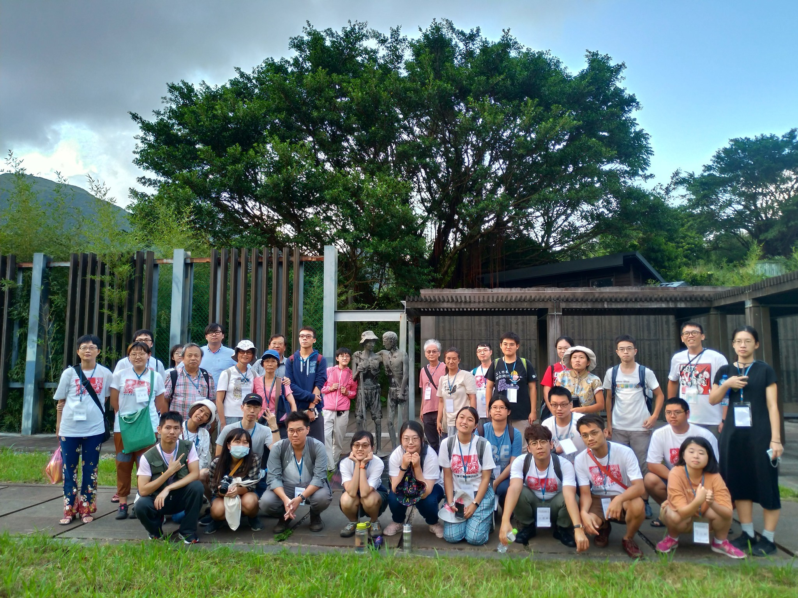
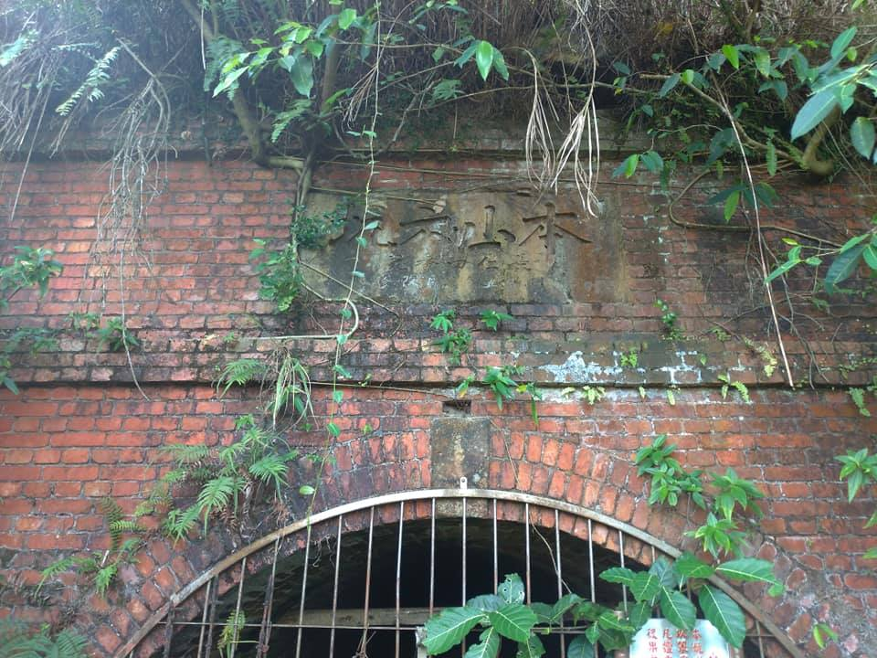

世新大學社會發展研究所每年夏季舉辦「草根學校」，旨在延續社會發展所創所理念「有學有術、實踐基層、回歸理論、再造社會」，藉由實際的田野走訪、深入淺出、活潑互動、激發討論的課程規劃，擴大青年學子對社會發展議題的視野。

## 2020 世新社發所夏季草根學校 
## 金瓜石 ——— 悠悠山城的百年史概述

# 金瓜石的淘金夢

   

金瓜石產金，最早可追溯到清朝建造基隆段鐵路時，鐵路工人在河中發現砂金，引起的淘金熱潮。1894年，淘金客順河流而上，發現了本山礦床露頭，又稱「大金瓜露頭」，此地就以「金瓜石」為名開始繁榮了起來。
日據時期，日本政府對台灣礦業資源高度重視，日籍實業家、技術人員與礦工大量來台開採，並禁止了民間的採礦，剝奪台人的採礦權，台人僅能從事搬運礦砂、開路、建廠等工作。

   

# 亞洲第一貴金屬礦山的起落

金價隨國際局勢浮動，牽動著礦山的起落，一次大戰時全球經濟蕭條，礦山經濟一度陷入低谷。1930年代迎來金價飛漲，礦山重新復甦，為解決人力的需求，大量引進中國山東、浙江、福建、廣東等沿海省份的「華工」，以溫州人為大宗，人數一度多達三千人，後隨著中日交惡而終止。1938年金瓜石礦山產量達到最高峰，得到「#亞洲第一貴金屬礦山」的讚譽，不過好景不常，1941年，日本政府發動太平洋戰爭，礦山產業再度衰退，並被迫轉以輸出國防物資銅礦為主，金礦不再受到重視。

 

   

# 日據時期金瓜石戰俘營與台人大搜捕

戰爭時期，日軍一面強迫戰場上捕獲的戰俘，在生活條件極惡劣的狀況下採掘銅礦，導致無數戰俘命喪於此；一面懷疑台人與中國串聯，對台人進行思想審查，發動大規模逮捕，被逮捕的百餘人中，殉難者達30餘人。

# 國民政府時期的以銅養金

戰後，國民黨政府接管台灣，也接管了金瓜石礦產的所有權，自此金瓜石所出產的金礦，由臺灣銀行以官定價格全數收購。不過隨著國共內戰，台灣實施戒嚴，民間物價飛漲，產金的成本過高，為應付軍事需求及彌補虧損，金瓜石重啟銅礦生產，並採行「以銅養金」的經營模式。

# 白色恐怖的噤聲

1950年韓戰爆發，美軍介入台海巡防，中共威脅暫緩，國民黨政府開始對島內「叛亂犯」進行強力肅清，金瓜石一帶就發生了「金瓜山支部案」、「#潘承德讀書會案」兩件白色恐怖案件，礦山陷入了漫長的噤聲。

# 百年產金歲月的結束

1970年代金銅礦脈日漸的枯竭，「台灣金屬礦業公司」開始進行大規模的露天開採，並轉移重心為礦物冶煉加工，另闢出路，時至1987年，終於因無力償還銀行貸款，宣告歇業，金瓜石百年的產金歲月就此結束。

## 2018 世新社發所夏季草根學校 
### 【德拉奇的淚與汗】 ── 找回小米感恩祭

今年的夏季草根學校我們來到了宜蘭縣的寒溪部落，與宜蘭縣崗給原住民永續發展協會合作，透過實際走訪寒溪部落，藉由田野參訪、議題分享與深入的討論分析，了解原住民部落過去在殖民歷史下的發展脈絡以及在現今資本主義體制下發展的困境，探討原住民部落發展的現況與以及未來發展的可能。  
 
   
 

### 寒溪部落與崗給協會  
      
      
● 寒溪部落  
 
寒溪地區(Llyung Lpayan)的泰雅族部落現主要以寒溪部落、四方林部落、華興部落、新光部落等四個部落所組成。而在現行宜蘭縣的行政區劃下，寒溪地區的四個部落全併入寒溪村，並 歸在宜蘭縣大同鄉管轄。
  
  
● 崗給原住民永續發展協會  
  
宜蘭縣崗給原住民永續發展協會是民國96年10月因為母語及水資源的議題及運動，讓寒溪居民體認到團結的重要性而成立。組織成立的目的是希望了解、解決部落的問題，並且喚醒寒溪居民對永續發展的自覺意識，也期待能不斷的透過組織培力以及組織幹部訓練來凝聚部落意見 ，為寒溪部落的發展找出共同的目地。

### 課程活動規劃  
  
         

【部落導覽】  
透過走訪宜蘭縣內最長吊橋-寒溪吊橋、日治時期神社、部落廚房，了解寒溪部落的歷史發展 脈絡與部落生活現況。  

 
【田野參訪】  
跟隨泰雅族獵人的腳步，了解泰雅族狩獵文化、認識林道環境及野生植物，並學習製作傳統狩獵陷阱。  

  
  
【專題座談】
 
● 原住民歷史與發展:  
邀請LIMA台灣原住民青年團團長洪簡廷卉耙梳原住民社會運動的大事紀，對照國際上的發展，比較國內外原住民議題的共通性和案例。  
  

  
● 小米與大米的產銷經驗對談:  
邀請宜蘭深溝村「有田有米」的自耕農吳佳玲，展開小米與大米的產銷經驗對話，分享如何透過支持型農業推廣友善農耕的永續發展。  
  

 
● 資本主義如何改變部落：  
了解原住民族殖民的歷史發展脈絡，如何形成原住民族今日在經濟、政治上形成無聲缺乏管道參與，在主流資本主義社會發展的脈絡下，造成部落低度發展、城鄉資源分布不均、部落人口老化的問題。  
  
  
  
● 部落長照的困境與發展：  
延續部落資本化的議題，分享寒溪部落推動部落長照遇到的困境，並分享如何透過部落組織非市場邏輯的運作，抵抗資本主義下造成的貨幣的依賴、照顧系統的式微、照顧證照化、專業化、管理化等等問題。  

  

 
● 部落紮根組織經驗分享:  
面對現代化、資本化的「寒溪部落」，如何因為水資源與母語的議題抗爭，以部落紮根組織的方式集結共識成立「宜蘭縣崗給原住民永續發展協會」，從一個部落的自我意識抬頭，發展部落觀光、小米復耕、水資源保育、部落廚房、部落照顧?

  

### 活動資訊  

- 活動時間:2018年7月13日(五)-7月15日(日)三天兩夜
- 活動地點:宜蘭縣大同鄉寒溪部落
- 招生對象:對原住民議題有興趣之校內外學生及社會人士 
- 報名費:新台幣3000元整，內含500元保證金（費用不含前往╱離開羅東火車站交通費用；完整參與三日活動，可退回保證金）  
- 住宿地點:寒溪農場
- 報名日期:即日起至6月30日截止(20名，額滿為止)
- 報名方式:表單填寫、匯款後方完成報名(詳見肆、報名方式) 
- 主辦單位:世新大學社會發展研究所
- 協辦單位:宜蘭縣崗給原住民永續發展協會

  

  

  

  
